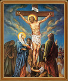

### Молитва Ісуса Христа

Коли Мій син вийшов на Єрусалимську гору, Його спіймали євреї з позором і призрінням, на голову положили терновий вінок і усе Його Обличчя вмилося Святою Кров’ю. Ісус говорить: «Дорогі мої, є тяжкий Мій Хрест і ранить побите тіло і вся кров стікає по моєму Хресті». Сьогодні святий день п’ятниця, якби знайшовся такий, щоб цю молитву кожен день, а в п’ятницю почитав три рази, то чого попросить — усіх ласкою, красою, мудрістю обдарує і врятує йому три душі з родини чи інших, за яких молився. За три до смерті дам знати час коли це станеться, а після смерти положу золотий вінок на його голову.

Мати Божа стоїть під Хрестом сина, Вона бачить Його страждання. Ісус говорить: «Іване, ти мій вірний слуга, візьми мою Матір за руку і відведи, щоб не бачила моїх страждань на Хресті».  Іван говорить: «Сину Божий, я візьму Твою Матір і відведу від хреста, і утішу, як батько своє дитя, щоб Вона не бачила Твого страждання на Твоїм смертнім Хресті, який з болем відчувається в її серці». В цей час здригнулась вся земля, потемніло сонце і місяць, а Матір Божа каже: «Це Мій Син переносить тяжкі муки і страждання на своїм смертнім Хресті».

Покапали каплі Крові Ісуса Христа, коли йшов на Голгофу. Голбвер-кат знайшов один лист на Святому Гробі Ісуса Христа, який був захований в одній касі окремо від срібла та грошей. Каса була власністю Батія, імператора Христина, Давида і Святої Єлизавети, Мальти, Дори і Гранети, всі вони хотіли знати про страждання Ісуса Христа.  Він говорить, що було 63 солдати, 180 разів били Його кулаками в плечі, прийняв 40 цвяхів і каменюк, 32 рази тягнули за бороду, підносили за волосся. Потім на Голгофі мене били палкою. Я був поранений 100 разів і битий 308 разів. Тоді впало 5432 каплі Крові, і наглядала 31 людина. Я помирав о другій годині в п’ятницю, коли пробили моє серце. Я відходив 130 разів, а тих, що мене убивали, було троє.

Ті хто будуть читати цей лист, матимуть силу і перемогу над злом. Якщо читати цей лист 15 років за Кров, яку пролив наш дорогий Спаситель, то тоді з неба вибачаться йому 5 гріхів, а може й вибачаться усі пекельні муки. А якщо помре раніше, то буде прийнято якби прожив 15 років і пролив свою кров за віру. Того, хто читає цей лист, Я зійду з неба і заберу його душу до неба, а також його родину аж до четвертого покоління. А тих, хто носитиме цей лист при собі, тому ніколи не буде важко у справах, усяке зло відійде від нього, а також величатиме Пречисту Матір Божу.

Святий Григорій говорив, що інший лист був знайдений в іншому місці і написаний золотими літерами. Збережи цей лист, який був написаний 16 січня 1750 року. В неділю не робити, бо Я вам дав шість днів щоб працювати, а сьомий – щоб молитися. Святкуйте цей день, щоб Спаситель вибачив гріхи ваші. Не забувайте давати милостиню сиротам, бідним, тоді ваш рід буде благословенний і багатий.

Якщо не вірите в цей лист, тоді напущу на вас велику чуму, голод, війни і великі захворування, вони зазнають силу небесного грому і землетрусів – це буде Моєю великою заплатою. Хто не вірить і скриє цей лист від людей, той буде покараний на Божому Суді. А якщо будете величати і читати цей лист, і буде просити прощення гріхів, а також дасть цей лист іншим, тоді його душа ніколи не загине, а буде врятована від всього зла і напасті. Амінь.

Люди, вірте в муки Спасителя, Який прийшов на землю заради нас. Цей лист дав один Камтор-монах який був на Святому Гробі Господньому. Пишіть, давайте людям, щоб каялися, про це просить сам Господь. Господи Ісусе Христе, Сину Божий, помилуй нас грішних. З вірою приклади до болючого місця, або до кровотечі, ворог не зможе заподіяти ніякої шкоди. Носіть цей лист на собі і він захистить від злих людей і поганих сусідів. Нехай Господь з небес завжди кличе нас грішних.  Якщо подати цей лист неплідній жінці, то стане плідною, а хто носить при собі, то біля нього є Ангел-Хоронитель, Архангел Мисаїл, і Всемогутній Бог, і ім’я Отця і Сина і Святого Духа. Амінь.

Не кляніться іменем Господнім, бо знищить вас. А в устах завжди майте Бога, прославляючи його. Амінь.
